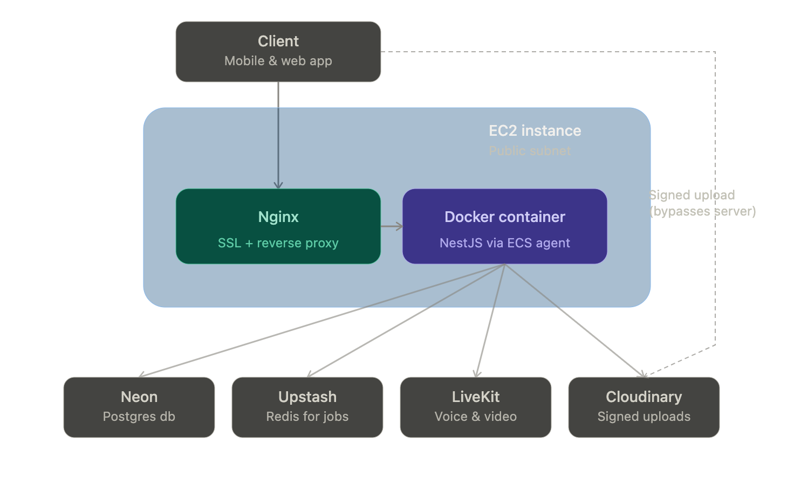

# SafeGround Infrastructure (Terraform)

Infrastructure-as-code for SafeGround's backend — a diaspora fintech platform
managing assets back home for Nigerians abroad. This repo provisions the AWS
infrastructure the backend server runs on, built with cost-efficiency and
simplicity as first-class goals, given the platform runs a persistent
Node.js/NestJS process (live voice/video calls, background jobs) rather than
short-lived request/response workloads.

## Architecture

A client (mobile or web) sends requests through Nginx (SSL termination and
reverse proxy) to a Dockerized NestJS application running on a single EC2
instance in a public subnet. The container is orchestrated by the ECS Agent
(EC2 launch type) rather than running via raw `docker run` — giving
auto-restart and structured deployment management without the cost of
Fargate, an Application Load Balancer, or a NAT Gateway, none of which this
architecture needs at this scale.

The backend talks out to a set of managed external services rather than
provisioning them on AWS:

- **Neon** — Postgres database
- **Upstash** — Redis, used by BullMQ for background job processing
- **LiveKit** — voice and video calling infrastructure
- **Cloudinary** — media storage, accessed via signed upload URLs

The signed-upload flow is deliberate: the client uploads files (images, video,
documents) **directly** to Cloudinary using a URL the backend generates and
signs — the file itself never passes through the EC2 server. Only the
resulting Cloudinary URL is stored in Postgres. This keeps bandwidth and load
off the single backend instance.

## What This Provisions

- A custom VPC with a single public subnet (no private subnet, no NAT
  Gateway — not needed for this architecture)
- Internet Gateway + route table for public internet access
- A security group scoped to exactly what the server needs: SSH (22), the
  application port, and HTTP/HTTPS
- One EC2 instance running Docker, with the ECS Agent registered to an ECS
  cluster (EC2 launch type) for container orchestration

## Key Design Decisions

**No NAT Gateway, no ALB, no Fargate.** These are the three most expensive
components in a typical ECS setup, and none are necessary here: a single EC2
instance in a public subnet can reach the internet directly (no NAT needed),
and with only one instance there's nothing to load-balance across (no ALB
needed). This keeps the AWS bill to essentially just the EC2 instance itself.

**ECS with EC2 launch type, not Fargate.** The ECS control plane itself is
free — only Fargate compute, ALB, and NAT Gateway cost money. Registering a
single EC2 instance to an ECS cluster gets the real orchestration benefits
(auto-restart on crash, structured Task Definition/Service management)
without paying Fargate's per-task premium.

**EC2 over Lambda.** The backend handles persistent, long-lived connections
(live voice/video calls via LiveKit, and BullMQ workers processing background
jobs continuously) — workloads Lambda's short-lived, stateless execution
model isn't suited for.

**External managed services instead of AWS-native equivalents** (Neon
instead of RDS, Upstash instead of ElastiCache, Cloudinary instead of S3 for
media). Each has a genuinely free tier that doesn't draw down the AWS
account's credit balance, and none require provisioning additional AWS
infrastructure to use.

## What's Next

- GitHub Actions CI/CD: build the Docker image, push to ECR, and have the ECS
  Service on the EC2 instance pull and deploy the new image automatically
- S3 + CloudFront for hosting the admin and user-facing frontend websites,
  kept separate from Cloudinary (used exclusively for user-uploaded media)

---

## Resource Reference

<!-- BEGIN_TF_DOCS -->
## Requirements

| Name | Version |
| ---- | ------- |
|  [aws](#requirement\_aws) | ~> 6.0 |

## Providers

| Name | Version |
| ---- | ------- |
|  [aws](#provider\_aws) | 6.64.0 |

## Modules

No modules.

## Resources

| Name | Type |
| ---- | ---- |
| [aws_ecr_lifecycle_policy.safeground_app_lifecycle_policy](https://registry.terraform.io/providers/hashicorp/aws/latest/docs/resources/ecr_lifecycle_policy) | resource |
| [aws_ecr_repository.safeground_app](https://registry.terraform.io/providers/hashicorp/aws/latest/docs/resources/ecr_repository) | resource |
| [aws_ecs_cluster.safeground_cluster](https://registry.terraform.io/providers/hashicorp/aws/latest/docs/resources/ecs_cluster) | resource |
| [aws_ecs_task_definition.safeground_app_task](https://registry.terraform.io/providers/hashicorp/aws/latest/docs/resources/ecs_task_definition) | resource |
| [aws_eip.safeground_aws_eip](https://registry.terraform.io/providers/hashicorp/aws/latest/docs/resources/eip) | resource |
| [aws_eip_association.safeground_eip_association](https://registry.terraform.io/providers/hashicorp/aws/latest/docs/resources/eip_association) | resource |
| [aws_iam_instance_profile.ecs_instance_profile](https://registry.terraform.io/providers/hashicorp/aws/latest/docs/resources/iam_instance_profile) | resource |
| [aws_iam_role.ecs_instance_role](https://registry.terraform.io/providers/hashicorp/aws/latest/docs/resources/iam_role) | resource |
| [aws_iam_role_policy_attachment.ecs_instance_role_policy](https://registry.terraform.io/providers/hashicorp/aws/latest/docs/resources/iam_role_policy_attachment) | resource |
| [aws_instance.safeground_ec2_instance](https://registry.terraform.io/providers/hashicorp/aws/latest/docs/resources/instance) | resource |
| [aws_internet_gateway.safeground_aws_vpc_ig](https://registry.terraform.io/providers/hashicorp/aws/latest/docs/resources/internet_gateway) | resource |
| [aws_route_table.safeground_aws_rt](https://registry.terraform.io/providers/hashicorp/aws/latest/docs/resources/route_table) | resource |
| [aws_route_table_association.safeground_aws_rt_association](https://registry.terraform.io/providers/hashicorp/aws/latest/docs/resources/route_table_association) | resource |
| [aws_security_group.safeground_aws_sg](https://registry.terraform.io/providers/hashicorp/aws/latest/docs/resources/security_group) | resource |
| [aws_subnet.safeground_aws_public_subnet](https://registry.terraform.io/providers/hashicorp/aws/latest/docs/resources/subnet) | resource |
| [aws_vpc.safeground_aws_vpc](https://registry.terraform.io/providers/hashicorp/aws/latest/docs/resources/vpc) | resource |
| [aws_vpc_security_group_egress_rule.allow_all_outbound](https://registry.terraform.io/providers/hashicorp/aws/latest/docs/resources/vpc_security_group_egress_rule) | resource |
| [aws_vpc_security_group_ingress_rule.allow_app_port](https://registry.terraform.io/providers/hashicorp/aws/latest/docs/resources/vpc_security_group_ingress_rule) | resource |
| [aws_vpc_security_group_ingress_rule.allow_http](https://registry.terraform.io/providers/hashicorp/aws/latest/docs/resources/vpc_security_group_ingress_rule) | resource |
| [aws_vpc_security_group_ingress_rule.allow_https](https://registry.terraform.io/providers/hashicorp/aws/latest/docs/resources/vpc_security_group_ingress_rule) | resource |
| [aws_vpc_security_group_ingress_rule.allow_ssh](https://registry.terraform.io/providers/hashicorp/aws/latest/docs/resources/vpc_security_group_ingress_rule) | resource |

## Inputs

No inputs.

## Outputs

| Name | Description |
| ---- | ----------- |
|  [ec2\_public\_ip](#output\_ec2\_public\_ip) | n/a |
|  [ecr\_repository\_arn](#output\_ecr\_repository\_arn) | n/a |
|  [ecr\_repository\_url](#output\_ecr\_repository\_url) | n/a |
|  [ecs\_cluster\_arn](#output\_ecs\_cluster\_arn) | n/a |
|  [ecs\_cluster\_name](#output\_ecs\_cluster\_name) | n/a |
<!-- END_TF_DOCS -->

<!-- BEGIN_TF_DOCS -->

## Requirements

| Name                                                   | Version |
| ------------------------------------------------------ | ------- |
|  [aws](#requirement_aws) | ~> 6.0  |

## Providers

No providers.

## Modules

No modules.

## Resources

No resources.

## Inputs

No inputs.

## Outputs

No outputs.

<!-- END_TF_DOCS -->
